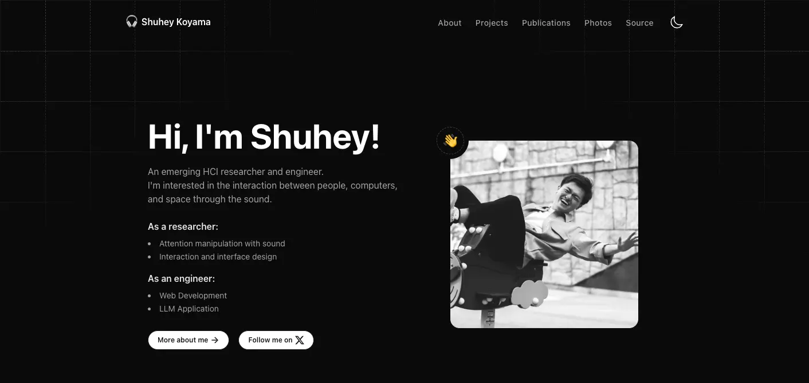

# Shuhey's Portfolio Website

A sleek and modern portfolio website showcasing my professional journey, projects, and creative pursuits. Built with Astro and React, featuring smooth animations and responsive design.

## 🌟 Live Demo

Visit the live website: [shuheykoyama.com](http://shuheykoyama.com)

## ✨ Features

- **Interactive Cursor Effects** - Engaging circular cursor tracker that follows user movements
- **Smooth Hover Interactions** - Polished animations and transitions for an enhanced user experience
- **Fully Responsive Design** - Seamlessly adapts to all screen sizes
- **Clean & Modern UI** - Carefully crafted interface focusing on readability and visual hierarchy

## 📋 Content Sections

- **About Me** - Personal introduction, ambitions, and skill set
- **Experience Timeline** - Professional journey and key milestones
- **Project Showcase** - Highlighting notable works and achievements
- **Publications** - Academic papers and research work (Coming Soon)
- **Photography** - Personal photography portfolio (Coming Soon)

## 🛠️ Tech Stack

- [Astro](https://astro.build/) - Static Site Generator
- [React](https://reactjs.org/) - UI Components
- [Tailwind CSS](https://tailwindcss.com/) - Styling
- [TypeScript](https://www.typescriptlang.org/) - Type Safety
- [React Icons](https://react-icons.github.io/react-icons/) - Icon Library

## 🎨 Design Philosophy

The website embodies three core principles:

- **Sophistication** - Clean, modern aesthetic that reflects professionalism
- **Usability** - Intuitive navigation and clear information hierarchy
- **Engagement** - Interactive elements that create a memorable user experience

## 📝 License

MIT License - feel free to use this project as inspiration for your own portfolio!

---

Built with ❤️ by Shuhey Koyama
